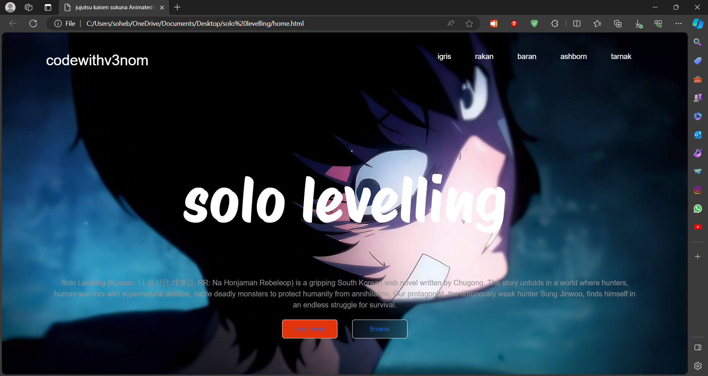

# Solo Leveling Animated Landing Page

## Description

This project is an animated landing page dedicated to Solo Leveling, featuring an immersive video background and stylish design elements. It provides information about the Solo Leveling web novel series and offers links for further exploration.

## Features

- **Animated Background**: The landing page utilizes an animated background video to create a dynamic visual experience.
- **Stylish Typography**: Custom fonts are used to enhance the visual appeal and convey the theme of Solo Leveling.
- **Navigation Bar**: The navigation bar provides easy access to different sections of the landing page.
- **Social Media Links**: Links to social media platforms are included for easy sharing and engagement.

## Installation

No installation is required to view the landing page. Simply open the HTML file in a web browser.

## Usage

To use this landing page, follow these steps:

1. Download the HTML and CSS files provided.
2. Open the HTML file in a web browser to view the landing page.
3. Explore the various sections and links provided on the landing page.

## Demo

## Credits

- **Fonts**: [Google Fonts](https://fonts.google.com/)
- **Background Video**: Replace `sololevelling.mp4` with your own video source.
- **Bootstrap Icons**: [Bootstrap Icons](https://icons.getbootstrap.com/)

## License

This project is licensed under the MIT License - see the [LICENSE](LICENSE) file for details.

---

Feel free to customize this README template further to add any additional information or sections as needed for your Solo Leveling animated landing page project.
